# Sistema de Garantías y Etiquetado — Manual de Usuario

**Productos Paraíso del Ecuador C.L.**
Sistema administrativo para el registro de productos, la creación e impresión de etiquetas de garantía (impresora Zebra) y el control de garantías.

---

## 1. Acceso al sistema

El panel administrativo se abre en la dirección del servidor, sección `/admin`.

1. Ingrese la dirección del sistema en el navegador (por ejemplo: `http://108.174.152.179/admin`).
2. En la pantalla de acceso, escriba su **correo electrónico** y su **contraseña**.
3. Presione el botón **Entrar**.

> Las credenciales son asignadas por el administrador del sistema (módulo **Usuarios**).

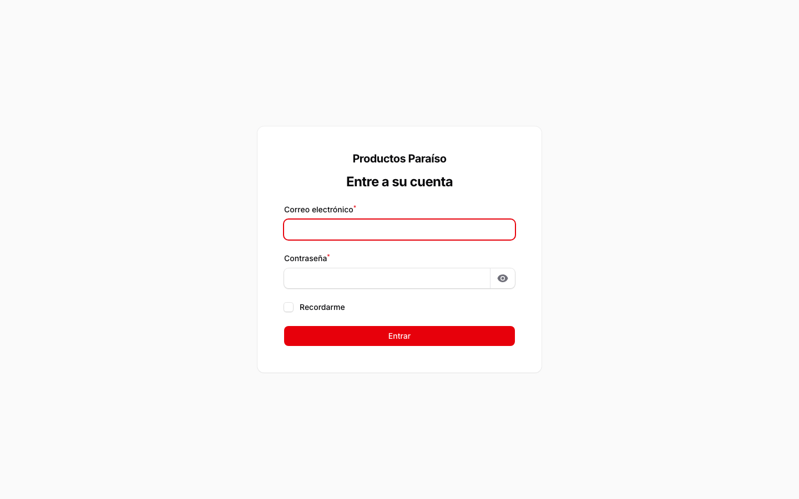

---

## 2. Estructura del menú

Una vez dentro, el menú lateral muestra los módulos en este orden:

| Grupo | Opciones |
|---|---|
| — | **Escritorio** |
| Clientes | Clientes |
| Etiquetas | **Crear etiquetas** · Bitácora de etiquetas · Etiquetas |
| Administración | Usuarios · Roles y Permisos |
| Garantías | Garantías |
| Productos | Productos |
| Configuración | Configuración Zebra |

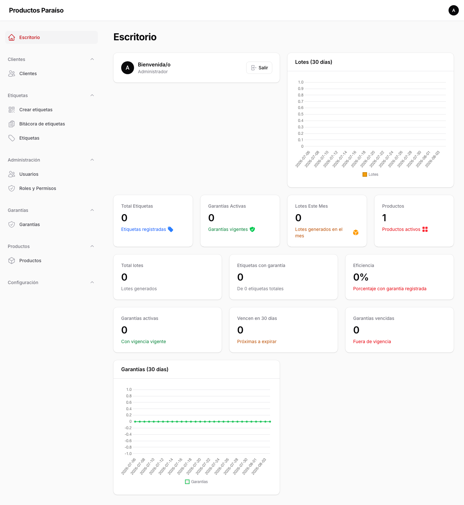

Algunos módulos de administración (por ejemplo, Categorías, Modelos o Composiciones) aparecen únicamente para los usuarios con los permisos correspondientes.

---

## 3. Clientes

Registro de clientes del sistema: nombres, tipo y número de documento, fecha de nacimiento, género, correo, teléfono, dirección, provincia, ciudad y sector.

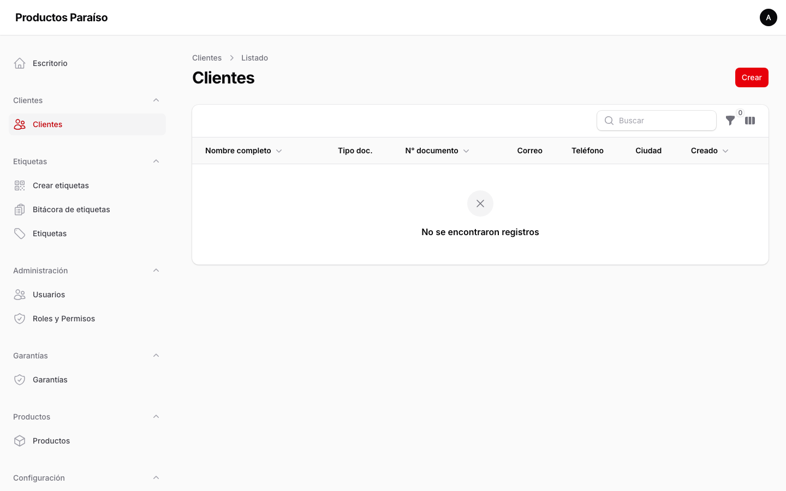

---

## 4. Productos

El módulo de **Productos** concentra la información comercial del producto junto con su **categoría** y **modelo** en un solo formulario: no hace falta crear categorías o modelos por separado antes de registrar un producto.

### 4.1 Listado de productos

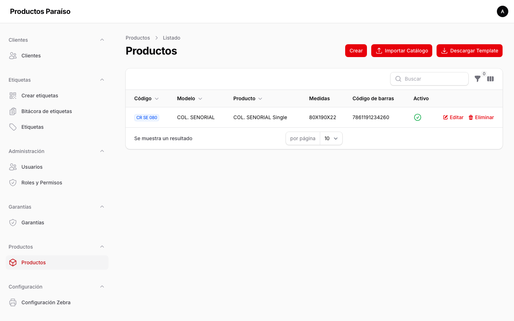

### 4.2 Registrar un producto (formulario unificado)

Al pulsar **Crear** se abre un formulario con las siguientes secciones:

- **Categoría**: nombre de la categoría. El **código de categoría** se genera automáticamente desde el nombre (mayúsculas, sin tildes, con guiones bajos).
- **Modelo**: nombre del modelo, con **código de modelo** autogenerado, tipo, clase y **años de garantía**.
- **Producto**: código de producto, nombre, nombre comercial, familia, código de barras y la **cantidad de etiquetas por defecto** que se usará al crear lotes.
- **Imagen de la etiqueta**: imagen que acompaña la etiqueta.
- **Composición técnica**: fabricante, país de fabricación, teléfonos, página web, composición (tela, banda, relleno), cuidados de la etiqueta y norma aplicable (por ejemplo, NTE INEN 2035).

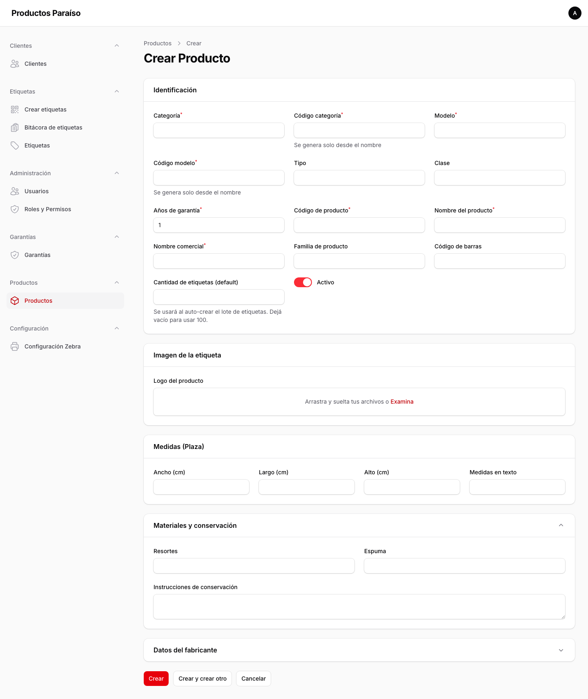

Si se escribe una categoría o un modelo que ya existe, el sistema los reutiliza automáticamente en lugar de duplicarlos.

---

## 5. Crear etiquetas

Es el módulo principal de trabajo. Desde aquí se crea un **lote de etiquetas** para un producto y se genera la cantidad de etiquetas solicitada.

### 5.1 Listado de lotes

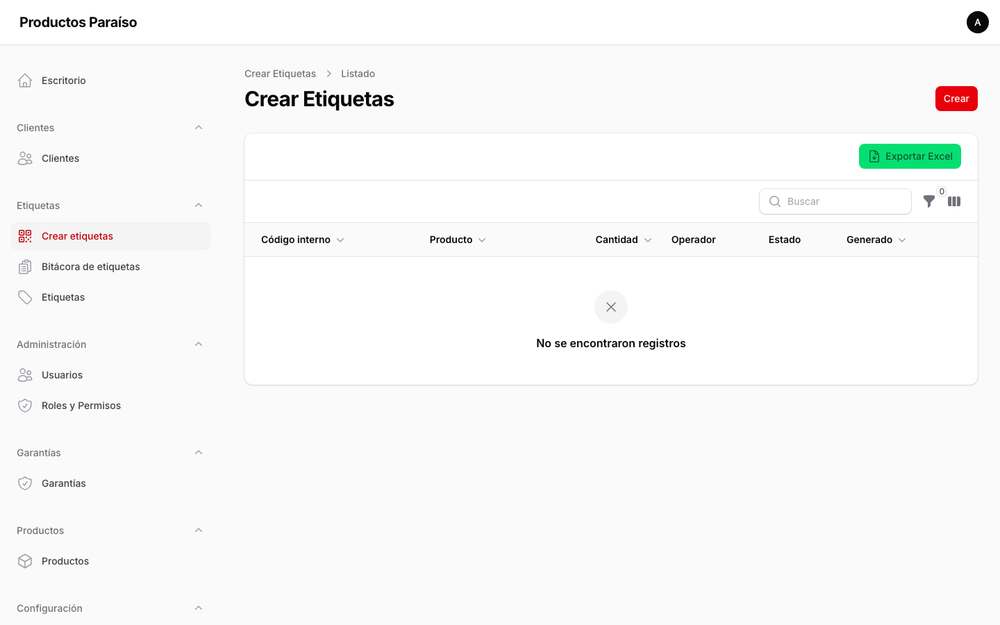

Cada lote muestra: código interno, producto, cantidad, operador, estado (activo, generado, anulado) y fecha de generación.

### 5.2 Crear un lote

1. Seleccione el **producto**.
2. Indique la **cantidad de etiquetas** a generar.
3. Complete **observaciones** si corresponde (opcional).
4. Guarde el lote: el sistema asigna automáticamente un **código interno** y un **número de lote** para el cliente.

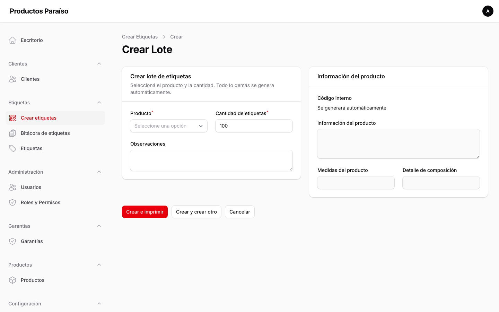

### 5.3 Número de lote

El número de lote usa el formato **mes y año + secuencial** (por ejemplo, agosto de 2026 genera `0826-001`, `0826-002`, ...). El secuencial se reinicia cada mes (`0926-001` en septiembre). Este número es el que se imprime en la etiqueta y sirve para identificar el lote ante el cliente.

### 5.4 Acciones del lote

Desde el listado (o al abrir un lote) se dispone de:

- **Generar etiquetas**: crea cada etiqueta del lote con su número de serie único.
- **Imprimir en Zebra**: envía las etiquetas a la impresora (vía el agente de impresión en Windows).
- **Marcar como impreso / Revertir impresión**: control del estado de impresión.
- **Descargar ZPL / PDF**: exporta la etiqueta en formato ZPL (impresora) o PDF (vista previa/documento).
- **Ver estado de impresión / Reanudar / Reintentar fallidas / Cancelar pendientes**: control de la cola de impresión.
- **Anular**: invalida el lote sin eliminarlo.
- **Exportar Excel**: descarga el listado de lotes.

---

## 6. Etiquetas

Listado de todas las etiquetas generadas, con su número de serie y lote al que pertenecen. Cada etiqueta puede imprimirse, descargarse en ZPL/PDF, marcarse como impresa o anularse.

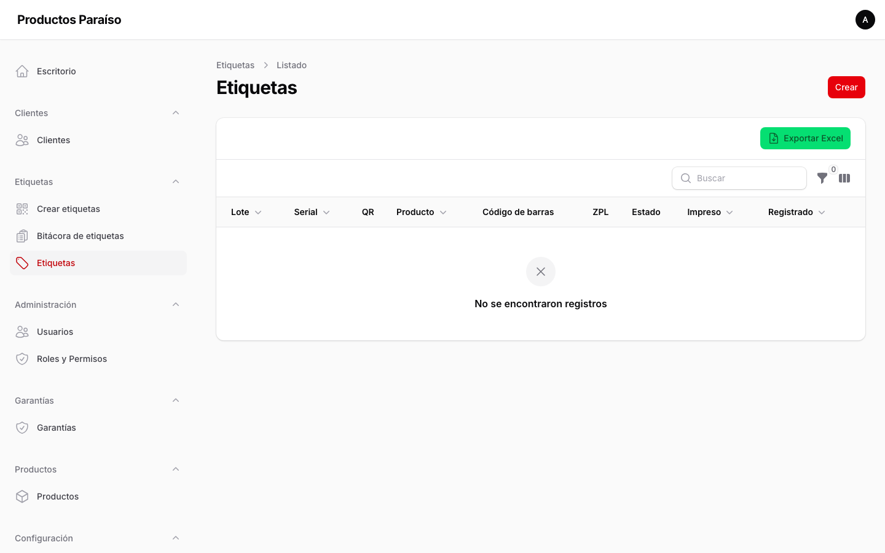

---

## 7. Bitácora de etiquetas

Registro histórico de las operaciones realizadas sobre etiquetas y lotes (creación, impresión, anulación, etc.), útil para auditoría y seguimiento.

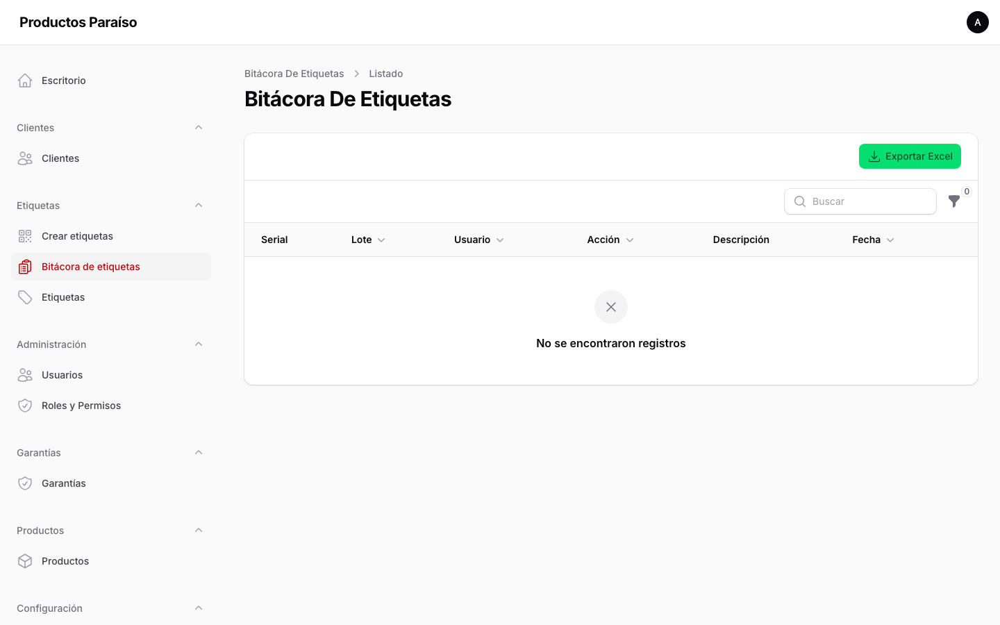

---

## 8. Garantías

Registro y control de las garantías asociadas a los productos y clientes. Desde aquí se gestiona el historial de garantías de cada producto.

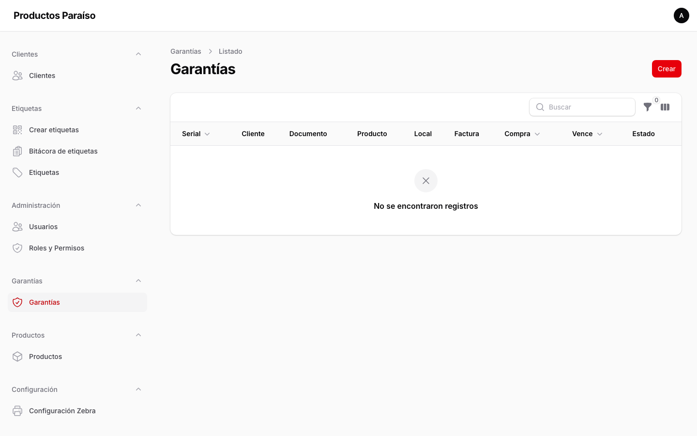

---

## 9. Usuarios

Administración de las cuentas del sistema: nombre, correo, contraseña y rol asignado.

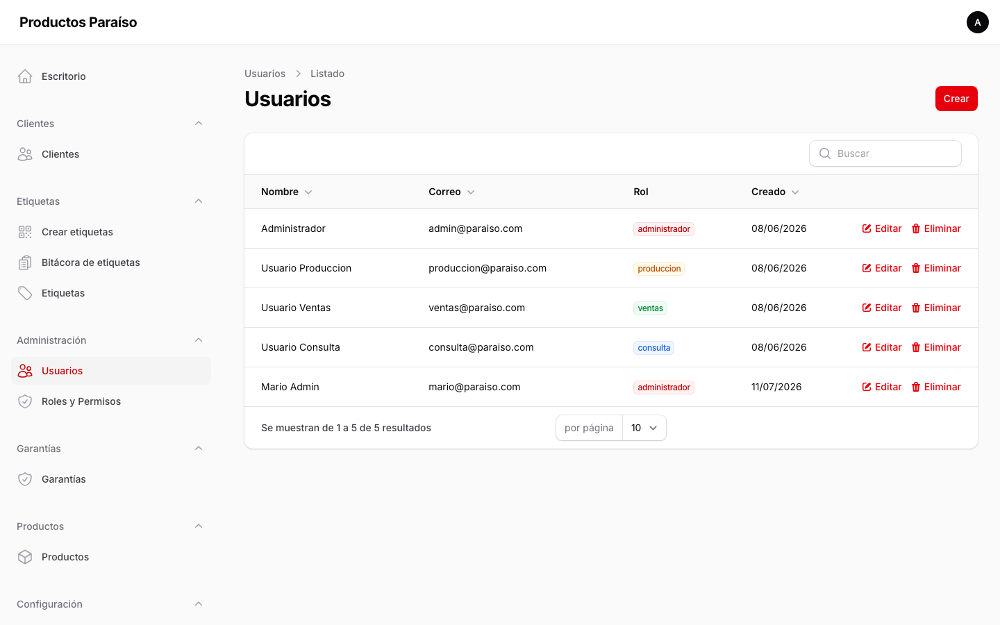

---

## 10. Roles y Permisos

Definición de roles (por ejemplo, Administrador, Operador) y los permisos que cada rol tiene sobre los módulos.

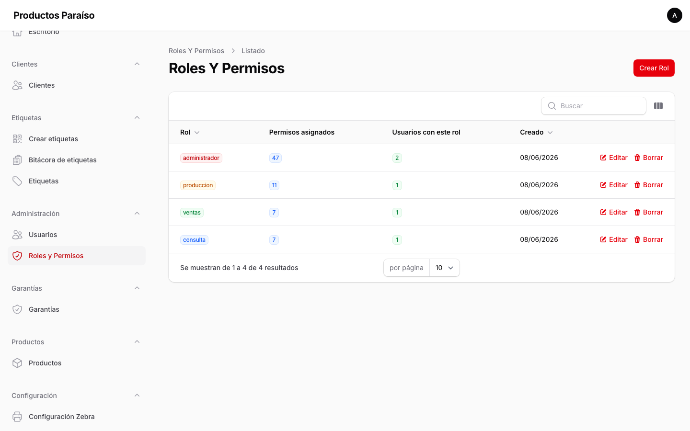

---

## 11. Configuración Zebra

Configuración de la impresora Zebra y del agente de impresión. Aquí se define el nombre de la impresora en Windows y las rutas/servicios de impresión.

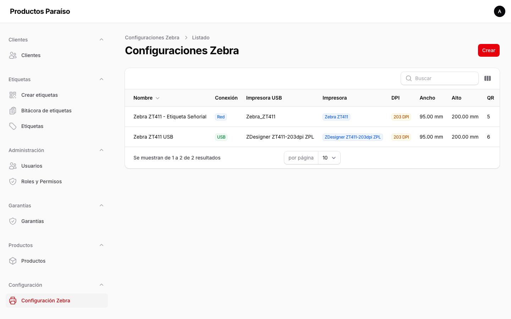

---

## 12. Flujo recomendado (resumen)

1. **Productos** → **Crear** → registrar el producto (categoría y modelo se crean en el mismo formulario).
2. **Crear etiquetas** → **Crear** → seleccionar el producto, indicar la cantidad y guardar.
3. En el lote creado, pulsar **Generar etiquetas**.
4. **Imprimir en Zebra** para enviar las etiquetas a la impresora.
5. Verificar en la **Bitácora de etiquetas** que todo quedó registrado.

---

## 13. Notas técnicas

- **Formato de lote**: `MMAA-###` (mes y año, dos dígitos cada uno) con secuencial de tres dígitos que rota cada mes.
- **Números de serie**: cada etiqueta generada lleva un serial único.
- **Impresión**: la impresora Zebra recibe las etiquetas a través del agente de impresión instalado en una máquina Windows en la red local (puerto 9100).
- **Exportaciones**: los listados de lotes, etiquetas, bitácora y garantías pueden exportarse a Excel.
